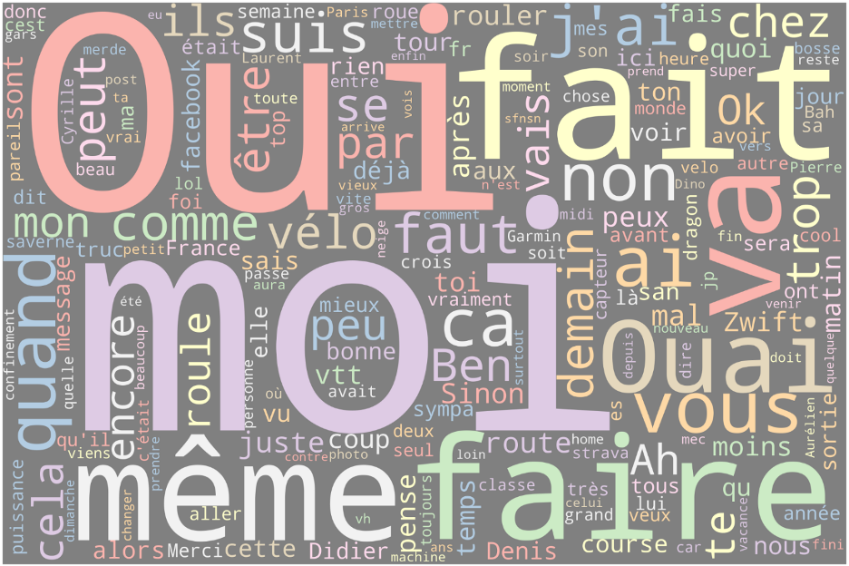
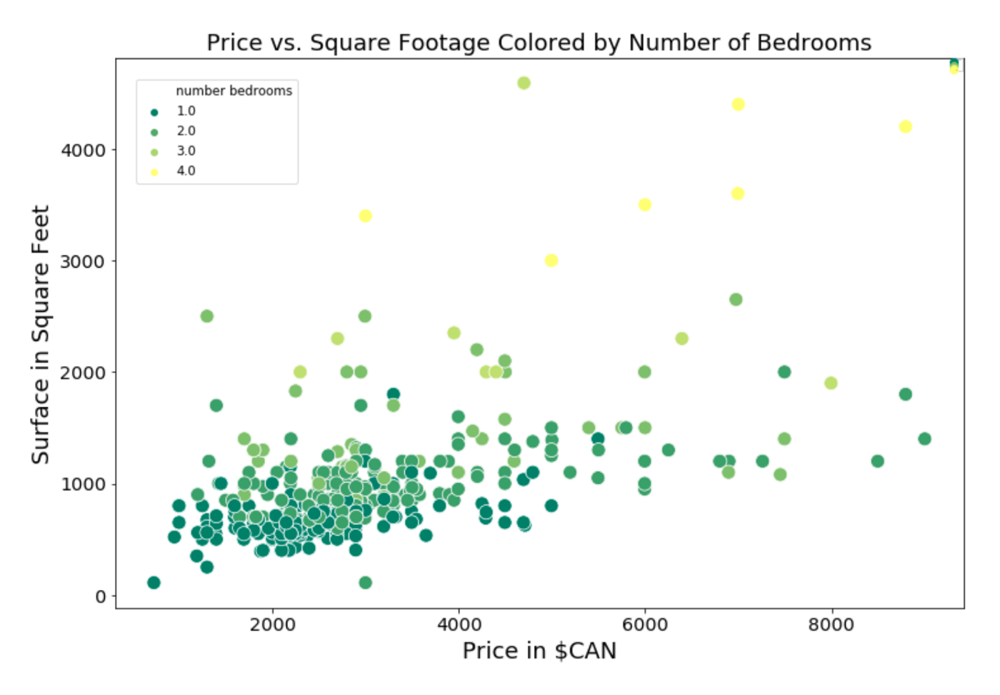
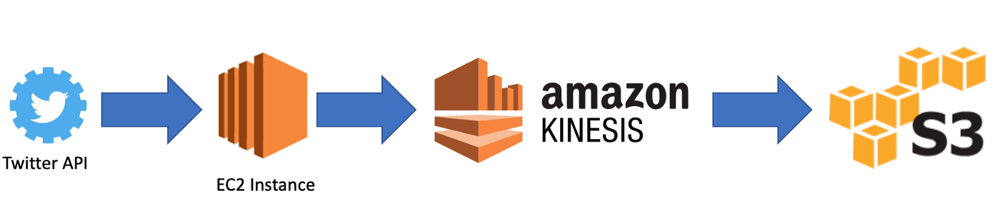
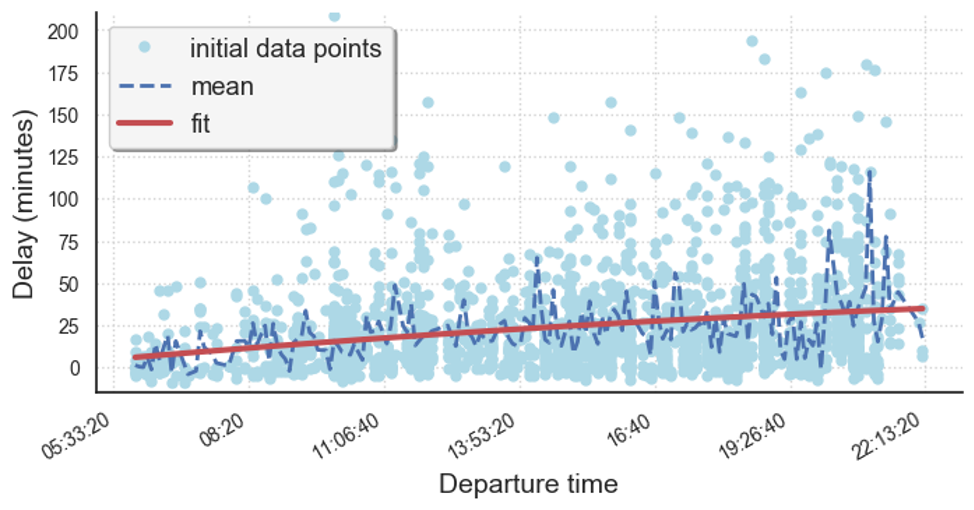

# Welcome to my portfolio

ABOUT ME:

Data Scientist who takes pride in building models that translate data points into business insights. Built up my skills in diverse projects, now eager to apply the same knowledge to real-world business problems.

- Strong knowledge in Biology with M.Sc. in Biology from Uppsala University.
- 2+ years of experience in statistical research.
- Strong understanding of statistics, machine learning, web scrapping and regression and classification. Example packages: numpy, pandas, scikit-learn, LGBM.
- Practical experience in predictive modelling (logistic regression, decision- tree), NLP and A/B testing.
- Proficient in statistical programming tools such as Python, R and SQL.
- Strong knowledge of Big Data tools (Spark, Hadoop), AWS cloud computing (EC2, EMR, S3, Redshift) and databases (Oracle, Redshift, MySQL).
- Experience with visualisation tools (Tableau, Matplotlib, Plotly, ggplot2).
- Excellent analytical and problem-solving skills.
- Bilingual English and French.
- Author for Towards Data Science, Data Driven Investor and Analytics Vidhya on Medium

Certification:
AWS Cloud Practitioner

You can connect with me on LinkedIn [here](https://www.linkedin.com/in/risserl/)

My [GitHub Profile ](https://github.com/walkyrie67)  

My [Resume](https://drive.google.com/file/d/1atQGP0nNCwwhLvURgtV_-ax-SNvYy4_O/view?usp=sharing) 

# My projects

This portfolio is a compilation of projects which I created using a wide range of data science tools for data analysis and predictions.

## Transform, explore and analyze a group chat on Whatsapp with NLP
### Project Type: Data Cleaning, Visualisation and Data Analysis

In this project I use unstructured data from a group chat on WhatsApp. I show how to transform the unstructured data to structured data and provide different visualisations of the data through plots done with Plotly. Finally, I provide interesting insights about the users in this group.

### [Medium Article - Get to know your friends with Natural Language Processing (NLP)](https://towardsdatascience.com/get-to-know-your-friends-with-natural-language-processing-nlp-38a1f6e56e09) 

### [Githup repo](https://github.com/walkyrie67/whatsapp_analysis)

## Housing Market, Web scrapping & Analysis
### Project Type: Data Collection, Cleaning, Analysis, Visualisation and Machine Learning

In this project I extract the data using Beautiful Soup library. I clean and manipulate the data using Pandas to end up with a structured data frame. Then, I analyze the data and identify interesting trends in the housing market and give a few recommendations for potential renters.

### [Medium Article - How to Scrap the Housing Market](https://medium.com/datadriveninvestor/how-to-scrap-the-housing-market-9081a1610fea?source=friends_link&sk=922dee31b18d73dbc03b1ff17dbffba0) 
### [Medium Article - House Pricing in Toronto, Exploratory Data Analysis and Correlations](https://medium.com/datadriveninvestor/house-pricing-in-toronto-exploratory-data-analysis-and-correlations-45d2f11475f4?source=friends_link&sk=86f7cc2f3b0dc90b3b4aa5f152c82d6e) 

### [Githup repo](https://github.com/walkyrie67/toronto_housing_webscraping/tree/master)

## Social Analysis with Twitter Data
### Project Type: Data Engineering and AWS

In this project I setup an ETL flow from the Twitter API to an S3 bucket. I use different services from AWS and I manipulate the Python and Shell scripts.

### [Medium Article - How to Create a Dataset with Twitter and Cloud Computing](https://towardsdatascience.com/how-to-create-a-dataset-with-twitter-and-cloud-computing-fcd82837d313?source=friends_link&sk=b56db9035ff3e59a68fbc19fbf211539)

### [Githup repo](https://github.com/walkyrie67/project2_big_data_gilets_jaunes)

## Predicting flight delays in the U.S.
### Project Type: Data Visualisation, Analysis and Machine Learning

In this project, I develop a model aimed at predicting flight delays at take-off. I comment on the importance of the separation of the dataset during the training stage and how cross-validation helps determine accurate model parameters. I show how to build linear and polynomial models for univariate or multivariate regressions.

### [Medium Article - Will your flight be late?](https://medium.com/analytics-vidhya/will-your-flight-be-late-36818ffe52b3?source=friends_link&sk=b12b06c3463c125b1370650e8b52bc9f) 

### [Githup repo](https://github.com/walkyrie67/flight_delay_prediction/blob/master/-Copy1.ipynb)

